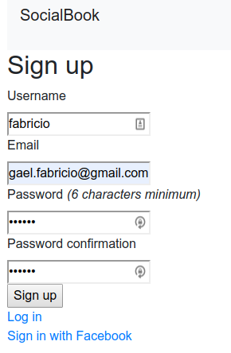
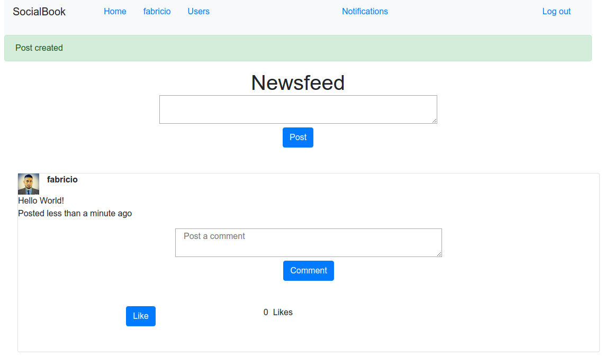

# Social Book

> This project is a basic Facebook Clone using Ruby on Rails 6.





The objective of the project is to practice our Rails skills in:
  - Architecture Development using ERD
  - Understand MVC
  - Associations
  - Use Devise Gem for authentication
  - Behavior Driven Development

## Built With

- HTML, CSS and Ruby
- Ruby on Rails 6 Framework
- Bootstrap
- RSpec and Capybara

## Live Demo

[Live Demo Link](https://powerful-scrubland-66847.herokuapp.com)


## Getting Started

**If you want to check this project, follow the  instructions on setting it up locally.**

To get a local copy up and running follow these simple example steps.

### Prerequisites

You need to have installed in your computer:

- [Rails v. 6](Getting Started with Rails — Ruby on Rails Guides
https://guides.rubyonrails.org › getting_started)
- [RSpec](https://rspec.info/)

### Setup

```source 'https://rubygems.org'
git_source(:github) { |repo| "https://github.com/#{repo}.git" }

ruby '2.6.5'

# Bundle edge Rails instead: gem 'rails', github: 'rails/rails'
gem 'rails', '~> 6.0.1'
# Use postgresql as the database for Active Record
gem 'pg', '>= 0.18', '< 2.0'
# Use Puma as the app server
gem 'puma', '~> 4.1'
# Use SCSS for stylesheets
gem 'sass-rails', '>= 6'
# Transpile app-like JavaScript. Read more: https://github.com/rails/webpacker
gem 'webpacker', '~> 4.0'
# Turbolinks makes navigating your web application faster. Read more: https://github.com/turbolinks/turbolinks
gem 'turbolinks', '~> 5'
# Build JSON APIs with ease. Read more: https://github.com/rails/jbuilder
gem 'jbuilder', '~> 2.7'
# Use Redis adapter to run Action Cable in production
# gem 'redis', '~> 4.0'
# Use Active Model has_secure_password
# gem 'bcrypt', '~> 3.1.7'
 gem 'devise'

# Use Active Storage variant
# gem 'image_processing', '~> 1.2'

# Reduces boot times through caching; required in config/boot.rb
gem 'bootsnap', '>= 1.4.2', require: false

group :development, :test do
  # Call 'byebug' anywhere in the code to stop execution and get a debugger console
  gem 'byebug', platforms: [:mri, :mingw, :x64_mingw]
  gem "database_cleaner"
  gem "rspec-rails"
end

group :development do
  # Access an interactive console on exception pages or by calling 'console' anywhere in the code.
  gem 'web-console', '>= 3.3.0'
  gem 'listen', '>= 3.0.5', '< 3.2'
  # Spring speeds up development by keeping your application running in the background. Read more: https://github.com/rails/spring
  gem 'spring'
  gem 'spring-watcher-listen', '~> 2.0.0'
end

group :test do
  gem "capybara"
  gem "selenium-webdriver"
end

# Windows does not include zoneinfo files, so bundle the tzinfo-data gem
gem 'tzinfo-data', platforms: [:mingw, :mswin, :x64_mingw, :jruby]
```

### Install

### Run tests

For testing the application you will need to run: `rspec spec`

## Authors

👤 **María Reyes**

- Github: [@majo_vainilla](https://github.com/majo_vainilla)
- Linkedin: [María José Reyes Parroquin](https://www.linkedin.com/in/majoreyesparroquin/)

👤 **Fabricio García**

- Github: [@fabricio-garcia](https://github.com/fabricio-garcia)
- Linkedin: [Fabricio García](https://www.linkedin.com/in/fabricio-garcia/)

## 🤝 Contributing

Contributions, issues and feature requests are welcome!

Feel free to check the [issues page](issues/social-book).

## Show your support

Give a ⭐️ if you like this project!

## Acknowledgments

- Final Project of the Rails Section from the [Microverse Curriculum] (https://www.microverse.org/)
- We follow the instructions of [The Odin Project](https://www.theodinproject.com/courses/ruby-on-rails/lessons/final-project)

## 📝 License

Feel free to fork this project and improve it.
